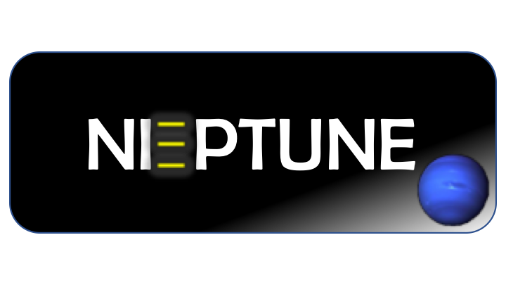

   

# NiPTUNE

NiPTUNE documentation avalaible here : https://niptune.readthedocs.io/en/latest/

# Publication
[NiPTUNE: an automated pipeline for noninvasive prenatal testing in an accurate, integrative and flexible framework](https://academic.oup.com/bib/advance-article/doi/10.1093/bib/bbab380/6370845)

# How to get the code

Niptune code is available [here](http://bit.ly/3bQjG5C), upon request for access to the corresponding author.
